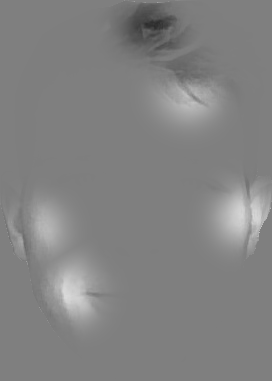
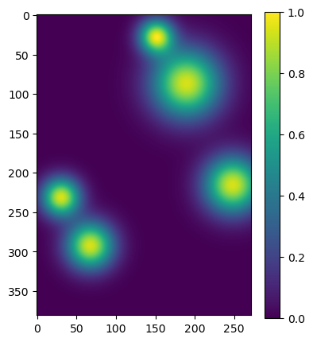
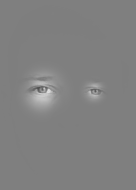
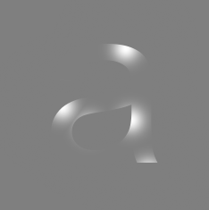
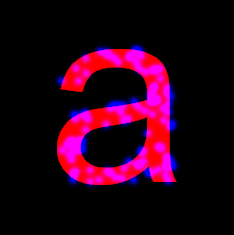
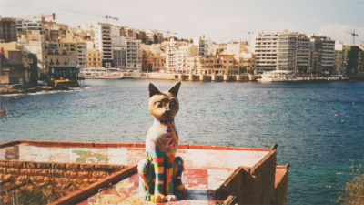
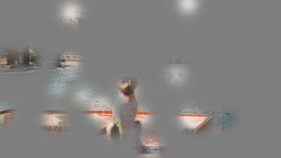
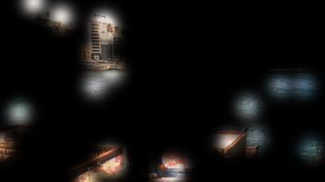

# bubbles

Python code for applying the Gaussian 'Bubbles' mask to image stimuli, as described by [Gosselin and Schyns (2001)](https://doi.org/10.1016/S0042-6989(01)00097-9). This approach applies a mask to an images, with a number of Gaussian 'bubbles' providing windows to the actual pixel values. The method is useful for probing the functional impact of information at different locations in an image (e.g., is face recognition easier when bubbles present the eyes). The method can also be applied to examine the size of such functional regions (varying sigma of the Gaussian bubbles), or features like colour (applying the technique to RGB separately) or the spatial frequency of relevant information (applying to specific frequency bandwidths).

The `bubbles` module implements the Gaussian bubbles method, applying a mask with any number of bubbles, optionally with per-bubble sigma parameters, to a given image. The 2-D bubbles are calculated using the cross product of 1=D Gaussian densities.

## Basic Usage

All functions are provided in module `bubbles.py`

```python
import bubbles
import os.path as op
from PIL import Image
```

`bubbles_mask()` is the main function, which generates and applies a mask with `len(sigma)` bubbles to a PIL image. By default, these will be positioned randomly. Here, we add 5 bubbles, all of sigma=20 to an image of a face on grey background.

```python
face = Image.open(op.join('img', 'face.png'))
face1, mask, mu_x, mu_y, sigma = bubbles.bubbles_mask(im=face, sigma=[20,20,20,20,20], bg=127)

face.show(); face1.show()
```




The function also outputs the mask as a `numpy` array.

```python
import matplotlib.pyplot as plt
plt.imshow(mask)
```



The function also outputs the x and y locations of the centres of the Gaussian bubbles (`mu_x` and `mu_y`) and the corresponding `sigma` values (equal to provided `sigma` argument).

```python
print(mu_x)
```

```
[151.47868249  30.62953573  67.66242641 248.33505263 189.49367428]
```

```python
print(mu_y)
```

```
[ 27.5013962  231.37643177 292.48458643 215.76040095  87.04159864]
```

```python
print(sigma)
```

```
[20, 20, 20, 20, 20]
```

## Specifying Bubble Locations

By default, `bubbles_mask()` will position bubbles randomly in the image. The exact desired locations of bubbles can be specified via the `mu_x` and `mu_y` arguments. Here I specify two bubbles to be centred on eyes, with different sigma values, of 20 and 10. Note that `mu_x` and `mu_y` can be floats.

```python
face2 = bubbles.bubbles_mask(
    im=face, mu_x=[85, 186.7], mu_y=[182.5, 182.5], sigma=[20, 10], bg=127
)[0]

face2.show()
```




## Avoiding Uninformative Locations

It is often more efficient to avoid adding bubbles to regions that you know have no informative information, such as the background. `bubbles_mask_nonzero()` uses a binary dilation method ([`skimage.morphology.binary_dilation`](https://scikit-image.org/docs/stable/api/skimage.morphology.html#skimage.morphology.binary_dilation)) to exclude regions of the background which are sufficiently distant as to be uninformative.

Specifically, the centres of each bubble (`mu_x`, `mu_y`) will be within `max_sigma_from_nonzero` multiples of that bubble's `sigma` value from a non-background pixel. Background pixels are identified as `im <= bg`.

The usage is similar to `bubbles_mask()`, but with additional argument `max_sigma_from_nonzero`.

```python
a = Image.open(op.join('img', 'a.png'))

a1 = bubbles.bubbles_mask_nonzero(
    im=a, sigma=[10,10,10,10], bg=127, max_sigma_from_nonzero=2
)[0]

a.show(); a1.show()
```




Here is a snippet demonstrating that `bubbles_mask_nonzero()` only selects bubble locations whose centres are `max_sigma_from_nonzero` standard deviations of the non-background pixels. This shows 100 bubbles (in blue) superimposed on the letter *a* (in red), with bubbles' centres at a maximum distance of 0.2 standard deviations from the character.

```python
a2, mask, mu_x, mu_y, sigma = bubbles.bubbles_mask_nonzero(
    im=a, sigma=np.repeat(5, repeats=100), bg=127, max_sigma_from_nonzero=0.2
)

a_arr = np.asarray(a).copy()
a_arr[a_arr==127] = 0
a_arr[:,:,1] = 0
a_arr[:,:,2] = mask * 255
Image.fromarray(a_arr).show()
```



Note: you can also specify a reference image, `ref_im`, from which the background pixels in `im` should be identified. This is useful in cases where `im` has already been altered (e.g., phase-randomised).

## Naturalistic Images

Typical stimuli using the Bubbles technique use artificial stimuli on grey backgrounds, but this method can also be applied to more naturalistic, colour stimuli, with the background defined by the `bg` argument.

```python
cat = Image.open(op.join('img', 'cat.jpg'))

cat1 = bubbles.bubbles_mask(im=cat, sigma=np.repeat(10, 20), bg=127)[0]
cat2 = bubbles.bubbles_mask(im=cat, sigma=np.repeat(10, 20), bg=0)[0]
cat3 = bubbles.bubbles_mask(im=cat, sigma=np.repeat(10, 20), bg=[127, 0, 55])[0]

cat.show(); cat1.show(); cat2.show(); cat3.show()
```






## Command Line Interface

The `bubbles_mask()` function can be accessed from the command line. This requires an `input` argument for a file path to the original image, and an `--output` argument, to write the result to file.

```
python bubbles.py --help
```

```
usage: bubbles.py [-h] -i INPUT -o OUTPUT -s SIGMA [SIGMA ...] [-x MU_X [MU_X ...]] [-y MU_Y [MU_Y ...]]
                  [-b BACKGROUND] [--unscaled] [--seed SEED]

options:
  -h, --help            show this help message and exit
  -i INPUT, --input INPUT
                        the file path for the input image
  -o OUTPUT, --output OUTPUT
                        the path of the desired output file
  -s SIGMA [SIGMA ...], --sigma SIGMA [SIGMA ...]
                        a list of sigmas for the bubbles, in space-separated format (e.g., "10 10 15")
  -x MU_X [MU_X ...], --mu_x MU_X [MU_X ...]
                        x indices (axis 1 in numpy) for bubble locations, in space-separated format - leave
                        blank (default) for random location
  -y MU_Y [MU_Y ...], --mu_y MU_Y [MU_Y ...]
                        y indices (axis 0 in numpy) for bubble locations, in space-separated format - leave
                        blank (default) for random location
  -b BACKGROUND, --background BACKGROUND
                        the desired background for the image, from 0 to 255 (default=0)
  --unscaled            do not scale the densities of the bubbles to have the same maxima
  --seed SEED           random seed to use
```
